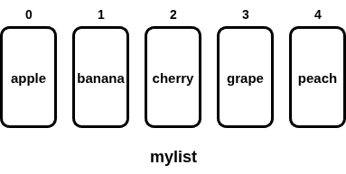

= For loops in Python
:source-highlighter: prism
:docinfo: shared-head, shared-footer
:docinfodir: /home/vern/Documents/demo_process_site/docinfo_files
:data-uri:

[.normal]

== Simple for loops in Python

Here are some examples of some simple for loops written in Python.  One of the most common uses of for loops, is to iterate over some array-like object.  In Python, such an object would be a *list*.  Here is a very simple example of such a for loop iterating over a list of strings.

=== For each style of for loop

[source,python,linenums]
----
mylist = ['apple', 'banana', 'cherry', 'grape', 'peach']

for fruit in mylist:
   print(fruit)
----

When run at the console, this would be the output:
[source,console]
apple
banana
cherry
grape
peach

Here is a diagram representing *mylist* that shows the indices and values for that list:

[.thumbnail]

Note that the index for each element is an integer that starts at zero and increases by one.  So, to access 'apple', you could refer to this as: 

[source,console]
mylist[0]

This style of for loop in the code is often called a *for each* style, as it is basically saying:

For each fruit in mylist
   print fruit

=== Index-based for loop

Python also has a for loop style that is similar to index-based for loops common to many other programming languages.  Here is an example using the index-based style.

[source,python,linenums]
----
mylist = ['apple', 'banana', 'cherry', 'grapes', 'peach']

for i in range(0, len(mylist)):
   print(mylist[i])
----

Here *i* is an index that is used to select a single element from the list.  The *range()* function goes from the first argument (0) up until but not including the size of the list (len(mylist) returns the size of the list).  See the above diagram for reference.  Although the index-based for loop is more work to implement, it is also more powerful as it is well suited to handling different elements in the list in a different manner.  The *for each* style of for loop is best suited for cases where you want to treat each element in the same way.

=== An accumulator example

For loops are often used in the *accumulator pattern*.  This pattern is useful for calculating things like totals and averages of a list.  Suppose we only want to get the average of numbers in a list, where the number is greater than 35.  Here is an example of how you can do this:

[source,python,linenums]
----
nums = [30,40,50,40,50,30]

total = 0
count = 0
for num in nums:
   if (num > 35):
      total += num
      count += 1

average = total/count
print("average:", average)
----

Here, *total* and *count* are called *accumulator* variables.  That is because they are used to accumulate a set of results.  The *accumulator* pattern is marked by setting an accumulator variable to 0 before a for loop.  Then inside the for loop the value of that accumulator is updated by adding the next value.  In this particular example, we also accumulate the *count*, because the average should only be based on the numbers that are greater than 35.  So, you could not get the correct average by dividing by the size of *nums*.

The result of running this program would be:

[source,console]
average: 45.0

