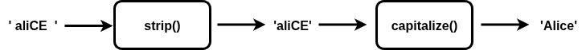

= While loops in Python
:source-highlighter: prism
:docinfo: shared-head, shared-footer
:docinfodir: /home/vern/Documents/demo_process_site/docinfo_files
:data-uri:

[.normal]

== Simple while loops in Python

For loops are often used to iterate over array-like objects like lists.  So, the number of repeats (number of times the for loop runs), is set by the size of the list.  While loops are repetition statements that will repeat a variable number of times, depending on the actual run time events.  Here is an example of a while loop that will run until the user decides to end the input:

[source,python,linenums]
----
names = []
done = False
while (not done):
   name = input("Enter a name or 'done' if done: ")
   name = name.strip().capitalize()
   if (name == 'Done'):
      done = True
   else:
      names.append(name)
      
print("names:", names)
----

The while loop will run until the test condition (*not done*) is no longer true.  So, when the variable *done* becomes True, the while loop will end.  Note that we use a selection statement on lines 16-19 to handle the input name.  We use *if* with an *else* clause so that the *names* list does not include the name "Done".  Here is a sample run of this program:

[source,console]
Enter a name or 'done' if done: aaron
Enter a name or 'done' if done: Bob
Enter a name or 'done' if done: Joe
Enter a name or 'done' if done: Heather
Enter a name or 'done' if done: done
names: ['Aaron', 'Bob', 'Joe', 'Heather']

Note that the *capitalize()* function in Python capitalizes just the first letter of the word it is operating on.

[.thumbnail]

[sidebar]
Python did not have Boolean variables at first.  So, like the *C* programming language, you could use any non-zero number for true and zero for false.  You could use things like empty lists for false too.  But, in version 2.3, Python added true Boolean variables.  They are: *True* and *False*.  Note that these variables must start with the capital letters as shown.

=== Using break

Here is a program that does essentially the same thing as the previous program.  But, it makes use of the *break* statement.  The *break* statement is used to immediately terminate the loop that directly contains the *break* statement.  This is the code:

[source,python,linenums]
----
names = []
while (True):
   name = input("Enter a name or leave blank when done: ")
   name = name.strip().capitalize()
   if (name == ""):
      break
   else:
      names.append(name)
      
print("names:", names)
----

Here on line 2, the while loop's test condition is always True, so this loop will run indefinitely.  So, on line 5 and 6, we test to see if the user has entered a blank name and if so, the *break* statement on line 6 ends the while loop.  If you run the program, you will see the same kind of output as the previous program:

[source,console]
Enter a name or leave blank when done: alice
Enter a name or leave blank when done: Douglas
Enter a name or leave blank when done: rambo
Enter a name or leave blank when done: 
names: ['Alice', 'Douglas', 'Rambo']

