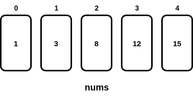
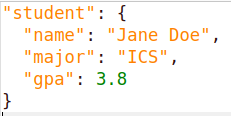

= For loops in JavaScript
:source-highlighter: prism
:docinfo: shared-head, shared-footer
:docinfodir: /home/vern/Documents/demo_process_site/docinfo_files
:data-uri:

[.normal]

== Simple for loops in JavaScript

Here are some examples of some simple for loops in JavaScript. As with other programming languages, for loops in JavaScript are useful for iterating through arrays or array-like objects.  Here are some exaamples.

=== JavaScript's for each style of for loop

Here is a simple example of a "*for each*" style for loop in JavaScript:

[source,javascript,linenums]
----
let nums = [1, 3, 8, 12, 15];

for (let num of nums) {
  console.log(num);
}
----

Here is a diagram showing what the *nums* array looks like:

[.thumbnail]

The *for (let item of array)* pattern is the JavaScript way of doing a *for each* style for loop.  Take special not of the keyword *of*.  This is how you iterate over all the objects in the array.

[sidebar]
In JavaScript, there is also a *for (let key in object)* pattern.  Note the use of *in*, instead of *of*.  This pattern is used to iterate over all the *keys* (properties) of an object.  This is different from the *for (let item of array)* pattern which iterates over all the *values* in the array.

If you run the above program, this will produce the following output:

[source,console]
1
3
8
12
15

=== Index-based for loop in JavaScript

As with most other programming languages, JavaScript has an index-based style of for loop too.  Here is an example:

[source,javascript,linenums]
----
let nums = [1, 3, 8, 12, 15];

for (let i = 0; i < nums.length; i++) {
  console.log(nums[i]);
}
----

The index-based for loop, makes it easier to treat different elements in the array differently, but is a little more work to set up than the "*for each*" style.  The output produced in this case is:

[source,console]
1
3
8
12
15

Let's rewrite the code, to only print out the elements of the array which have an odd index.  

[source,javascript,linenums]
----
let nums = [1, 3, 8, 12, 15];

for (let i = 0; i < nums.length; i++) {
  if ((i%2) == 1) {
    console.log(nums[i]);
  }
}
----

On lines 4-6, we have a selection statement that only prints out the element if the index (*i*) is an odd number.  So, the output when this program is run would be:

[source,console]
3
12

That is because the index is odd for those elements: +
nums[1] is 3 +
nums[3] is 12

=== Iterating over keys of an object

Here is an example of using a for loop to iterate over all the keys of an object:

[source,javascript,linenums]
----
let student = {}
student.name = 'Jane Doe';
student.major = 'ICS';
student.gpa = 3.8;

console.log('Student Jane Doe:');
for (let key in student) {
  console.log(`${key}: ${student[key]}`);
}
----

Here is a diagram showing what the *student* object looks like:

[.thumbnail]

Lines 1-4 create an object named *student* and define some properties for that *student*.  Line 6 prints a little header.  The for loop on lines 7-9 iterate over all the keys in *student* and display the *key* and the key's *value*.  Here is the output from running this program.

[source,console]
Student Jane Doe:
name: Jane Doe
major: ICS
gpa: 3.8

