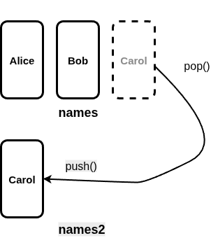
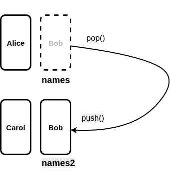
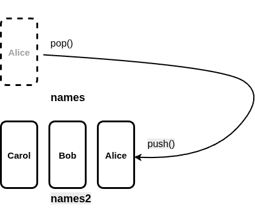
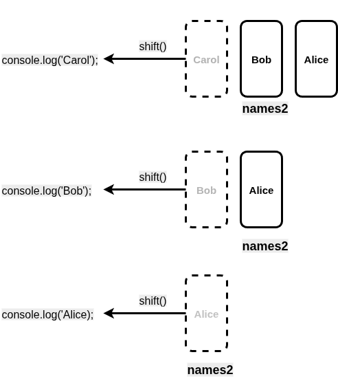
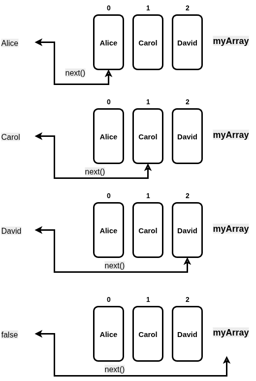

= While loops in JavaScript
:source-highlighter: prism
:docinfo: shared-head, shared-footer
:docinfodir: /home/vern/Documents/demo_process_site/docinfo_files
:data-uri:

[.normal]

== Simple while loops in JavaScript

Here are some simple examples of while loops in JavaScript.  Like while loops in other programming languages, while loops in JavaScript are repetition statements that repeat until some condition is met.  The number of repetitions for a while loop depend on the code that the while loop is running within.  So, they are useful when you don't know how many repetitions will be needed while writing the code.

=== While loops that run until something is used up

Here is program that uses while loops that would work irrespective of the size of the arrays that are being used:

[source,javascript,linenums]
----
let names = ['Alice', 'Bob', 'Carol']; // assume the contents is determined by something else
let names2 = [];

while (names.length > 0) {
  names2.push(names.pop());
}

while (names2.length > 0) {
  console.log(names2.shift());
}
----

On line 1, we hard-coded the *names* array.  But, assume that we don't know what the *names* array looks like.  The while loop on lines 4-6 will work for any array called *names*.  What it does, is fill an array called *names2* that will have the same elements as *names* but in reverse order.  The while loop on lines 8-10, will just print out the contents of *names2*.  As you can see from the output below, the order of the elements is reversed from the original hard-coded array.

[source,console]
Carol
Bob
Alice

Here are some diagrams that may help you to see how this is working:

[.thumbnail]

[.thumbnail]

[.thumbnail]

[.thumbnail]

=== Making use of an iterator

While loops can make use of an iterator.  In this next program, we will use the *makeIterator()* function that will create an iterator out of the passed array.  An iterator is an object that will return the next element in the object by calling the *next()* function.  That *next()* function will return false, when all the elements have been processed.

[source,javascript,linenums]
----
function makeIterator(array) {
  let index = 0;
  
  return {
    next: function() {
      if (index < array.length) {
        return array[index++];
      }
      else {
        return false;
      }
    }
  }
}

const myArray = ['Alice', 'Carol', 'David'];
const myIterator = makeIterator(myArray);

let num;
while ((num = myIterator.next())) {
  console.log(num);
}
----

Lines 1-14 define the *makeIterator()* function.  This creates an *iterator* from the passed array.  On line 2, the variable *index* is declared and set to 0.  When *index* is incremented (on line 7), this makes it so that the selection statement that starts on line 6 can control the number of times that *next()* will return a value from the array.  When the array has been exhausted, the *next()* function will return false (line 10).  

Line 16 defines a hard-coded array, called *myArray*.  Line 17 calls the *makeIterator()* function to create the iterator called *myIterator*.  Line 58 defines the variable, *num*, to hold the value returned by *myIterator.next()*.  Lines 18-20 define the while loop that will run, as long as the statement *num = myIterator.next()* is true.  Line 19 just prints out the value from the array.  

Here is a diagram that shows how the next() function is working:

[.thumbnail]

The output from running this program is:

[source,console]
Alice
Carol
David

[sidebar]
The *for (let item of array)* pattern uses a built-in iterator similar to this iterator to process each item of the array, in the order of the items of the array.  Hopefully, you can see that this pattern makes it simpler to iterate over an array, as opposed to having to define your own iterator.
